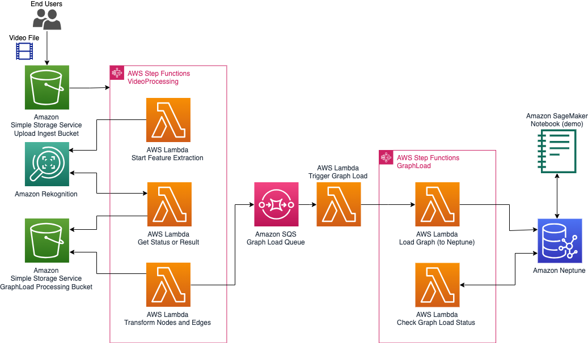
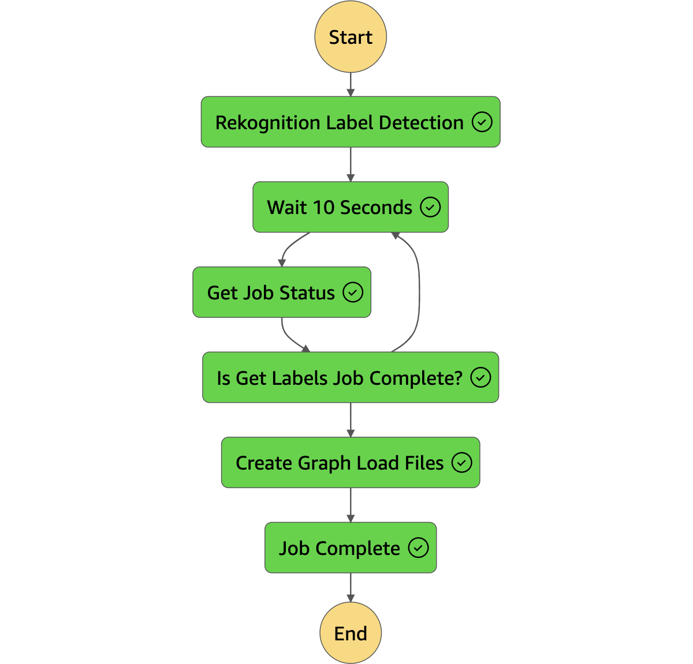
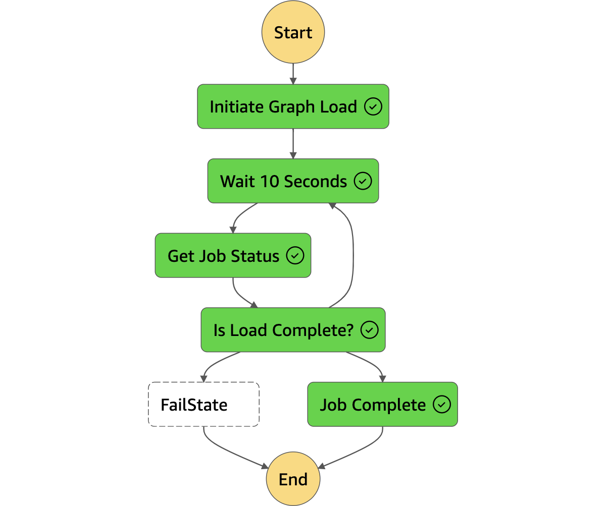

# Graph Extract, Transform, and Load (ETL)

This repository contains deployable stack for performing ETL on videos and loading extracted entities into a graph.

## Table of Contents
1. [Background](#Background)
2. [Overview](#Overview)
3. [Deployment](#Deployment)
4. [Usage](#Usage)
4. [License](#License)

## Background <a id="Background"></a>

Customers are eager to explore and comprehend their data from new perspectives. Unstructured data such as text and video is rich with information that can deliver valuable insights. Ingesting this data is easy using AWS services, however, studying relationships between features in the data is best handled using graph representations. This repository contains the necessary resources for deploying a Graph ETL stack using AWS Serverless Application Model (SAM). 

The deployed stack consists of an event-driven, stateful orchestration of tasks to process incoming video data. Specifically, when a new object is added to the Amazon S3 ingestion bucket, the `PutObject` event initiates an AWS Step Function. The AWS Step Function orchestrates a series of AWS Lambda Functions that perform feature extraction using Amazon Rekognition. The extracted data is then transformed and loaded into an Amazon Neptune graph for further analysis.

## Overview <a id="Overview"></a>

The solution consists of the following components:

1. **Ingestion Bucket**: Amazon S3 bucket for uploading objects.
2. **AWS Step Functions**: Orchestration of the ETL process using a series of AWS Lambda Functions.
3. **AWS Lambda Functions**: Functions to perform feature extraction, transformation, and loading of data.
4. **Amazon Rekognition**: Service used for image and video feature extraction.
5. **Amazon Comprehend**: Service used for natural language processing and sentiment analysis.
6. **Amazon Neptune**: Graph database to store the transformed and loaded data.

### Architecture

<p style="text-align:center">
    
</p>

Two AWS Step Functions orchestrate a set of AWS Lambda Functions to first extract the entities from the video, and then load them into a graph on Amazon Neptune. The functions make use of asynchronous calls to avoid any limitations for processing times.

<p style="text-align:center">
    
    <span style="width:10px">&nbsp;</span>
    
</p>

For more details see the [draw.io](https://drawio-app.com/) diagram as well as the flow diagram for the Step Functions in the `Assets` directory.


## Deployment <a id="Deployment"></a>

Deploying the GraphETL sample depends on the following pre-requisites:

- AWS CLI installed and configured with appropriate permissions
- AWS SAM CLI installed
- Python 3.9 (might require manual install)
- (Optional) Amazon Neptune instance configured and running

1. Clone this repository:
```bash
git clone https://github.com/aws-samples/etl-into-amazon-neptune-graph
cd GraphETL
```

2. Build the AWS SAM application:
```bash
make build
```

3. Deploy the AWS SAM application:
```bash
make deploy
```

Follow the guided prompts to provide necessary information for deployment.

4. After the deployment is complete, the AWS CloudFormation stack will provide the necessary information, including the name of the created S3 ingestion bucket.

## Usage <a id="Usage"></a>

1. Upload an object (image or text file) to the S3 ingestion bucket:
```bash
aws s3 cp <local-file-path> s3://<ingestion-bucket-name>/
```

2. The S3 PutObject event will trigger the first of two AWS Step Functions, which orchestrates the Extraction and Transform stages of the ETL process. Amazon Rekognition processes the video and extracts the features that will comprise our graph.

3. The first Step Function will leverage the Amazon Simple Queue Service (SQS) to indicate to the second Step Function that the graph edges and nodes are ready to be loaded to Amazon Neptune.

3. The second Step Function will invoke another series of Lambda Functions to perform the Load stage of the ETL process putting the extracted features into an Amazon Neptune graph database.

4. Users can view the graph data in Amazon Neptune using the Neptune Workbench, the sample Amazon SageMaker Notebooks created in the deployed stack, or other preferred query tools.

**Remember to delete the stack once you are done using it to avoid incurring in unnecessary charges.**

## License <a id="License"></a>

This project is licensed under the MIT License. See the [LICENSE](LICENSE) file for details.

