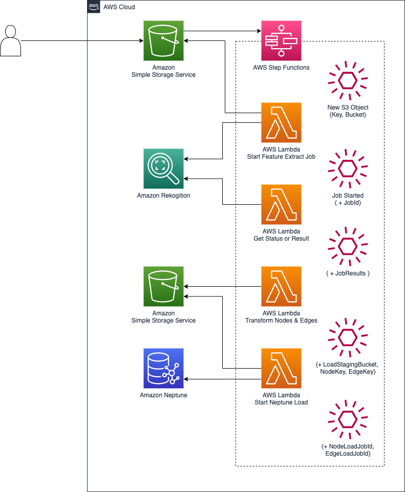
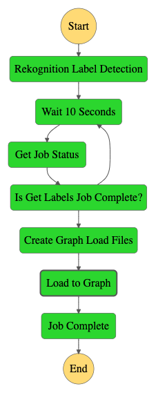

# Graph Extract, Transform, and Load (ETL)

### Purpose

Customers are eager to explore and comprehend their data from new perspectives. Unstructured data, such as text and video, is rich with information that can deliver valuable insights. Ingesting this data is easy using AWS services. This repository contains the necessary resources for deploying a Graph ETL stack using AWS Serverless Application Model (SAM). The deployed stack consists of an event-driven, stateful orchestration of tasks to process incoming video and text data. Specifically, when a new object is added to the Amazon S3 ingestion bucket, the `PutObject` event initiates an AWS Step Function. The AWS Step Function orchestrates a series of AWS Lambda Functions that perform feature extraction using Amazon Rekognition and Amazon Comprehend. The extracted data is then transformed and loaded into an Amazon Neptune graph for further analysis.

## Overview

The solution consists of the following components:

1. **Ingestion Bucket**: Amazon S3 bucket for uploading objects.
2. **AWS Step Functions**: Orchestration of the ETL process using a series of AWS Lambda Functions.
3. **AWS Lambda Functions**: Functions to perform feature extraction, transformation, and loading of data.
4. **Amazon Rekognition**: Service used for image and video feature extraction.
5. **Amazon Comprehend**: Service used for natural language processing and sentiment analysis.
6. **Amazon Neptune**: Graph database to store the transformed and loaded data.

## Architecture

<p style="text-align:center">
    
    
</p>

Also see the [draw.io](https://drawio-app.com/) diagram in the `assets` directory.

<p style="text-align:center"></p>

## Prerequisites

- AWS CLI installed and configured with appropriate permissions.
- AWS SAM CLI installed.
- Python 3.9 (might require manual install).
- Amazon Neptune instance configured and running.

## Deployment

1. Clone this repository:
```bash
git clone https://gitlab.aws.dev/famestad/GraphETL .
cd GraphETL
```

2. Build the AWS SAM application:
```bash
make build
```

3. Deploy the AWS SAM application:
```bash
make deploy
```

Follow the guided prompts to provide necessary information for deployment.

4. After the deployment is complete, the AWS CloudFormation stack will provide the necessary information, including the name of the created S3 ingestion bucket.

## Usage

1. Upload an object (image or text file) to the S3 ingestion bucket:
```bash
aws s3 cp <local-file-path> s3://<ingestion-bucket-name>/
```

2. The S3 PutObject event will trigger the AWS Step Function, which orchestrates the ETL process.

3. The Step Function will invoke a series of Lambda Functions to perform feature extraction using Amazon Rekognition and Amazon Comprehend, transform the extracted data, and load it into the Amazon Neptune graph database.

4. You can view the graph data in Amazon Neptune using the Neptune Workbench or other query tools.

## License

This project is licensed under the MIT License. See the [LICENSE](LICENSE) file for details.

